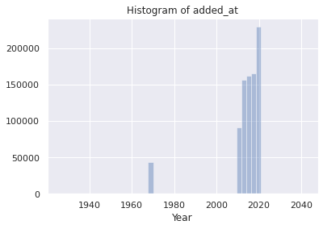
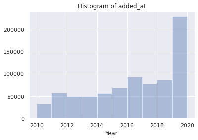
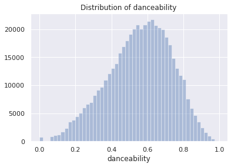
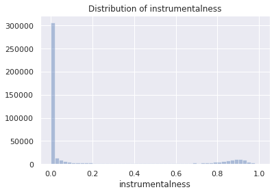
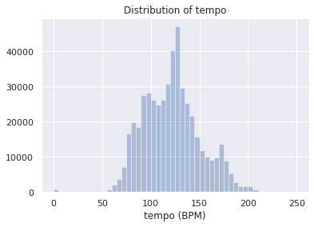
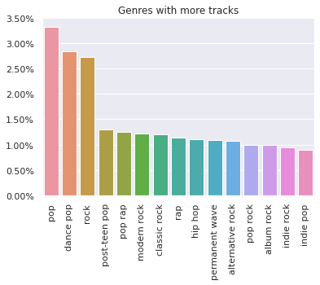
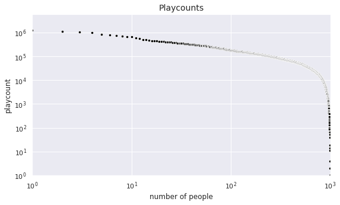
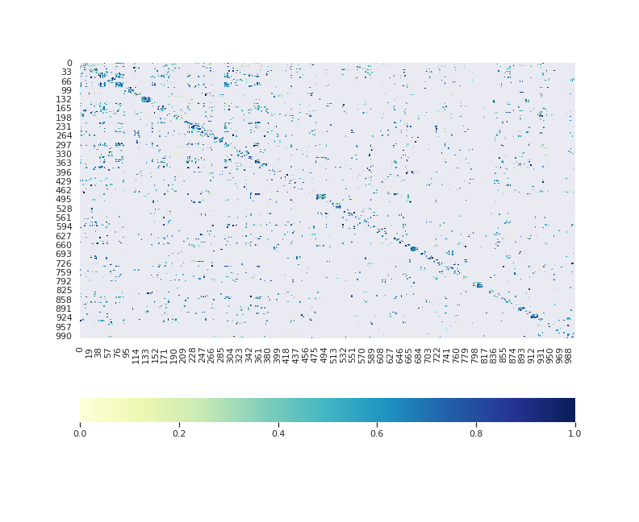

# Exploratory Data Analysis

We created two datasets: the Spotify's and the Last.fm's.

## Spotify dataset analysis

Spotify has a web API, and this API has a translation to Python called Spotipy. It allows us to search for tracks, playlists and artists data. Among all the information available, there exists what is called *audio features*, that is, musical metrics like `danceability`, `loudness` and `instrumentalness`, which could be important for recommendation systems.

Data was captured using the API. The approach was:
1. We started with a big number of Last.fm users, because Last.fm allows network search (search for the friends of a user, and its friends, and so on...);
2. We select a subset of 1000 random users which also has a Spotify account;
3. We selected their public playlists;
4. We selected the tracks from these playlists;
5. We selected the audio features and the artists from these tracks.

It's important to note that songs don't have genres using this API. Who has genre is the artist of the track. So it's necessary to gather the artists of the tracks in order to have genre information.

At the end, we have:

- Users **tracks** dataset;
- List of **users**;
- **Playlists** of the tracks;
- **Audio features** of the tracks;
- **Artists** of the tracks.

We now make some exploration in order to get known the data and have insights for the recommendation models.


```python
from collections import Counter
import glob
import matplotlib.pyplot as plt
import numpy as np
import pandas as pd
import seaborn as sns
```


```python
# Necessary to improve exploration
pd.set_option('display.max_columns', None)

# Beautiful Seaborn
sns.set()
```

We have many datasets, and we wanna know its variables. Let's sample them.

### Tracks dataset


```python
tracks = pd.read_pickle('../../data/sp_tracks_ready_999.pkl')
tracks.sample()
```


<div>
<style scoped>
    .dataframe tbody tr th:only-of-type {
        vertical-align: middle;
    }

    .dataframe tbody tr th {
        vertical-align: top;
    }

    .dataframe thead th {
        text-align: right;
    }
</style>
<table border="1" class="dataframe">
  <thead>
    <tr style="text-align: right;">
      <th></th>
      <th>added_at</th>
      <th>added_by</th>
      <th>is_local</th>
      <th>playlist_id</th>
      <th>available_markets</th>
      <th>...</th>
    </tr>
  </thead>
  <tbody>
    <tr>
      <th>15746</th>
      <td>2018-06-23 20:54:16+00:00</td>
      <td>isab3lla</td>
      <td>False</td>
      <td>3sBVA5SQr1uzHRSSzidYNy</td>
      <td>[SE]</td>
      <td>...</td>
    </tr>
  </tbody>
</table>
</div>


**Tracks** dataset is big enough to make we split it in many files. So we did it. At now we have 11 files just for the tracks. But the other datasets are compressed in a single file each one.


```python
list(tracks.columns)
```


    ['added_at',
     'added_by',
     'is_local',
     'playlist_id',
     'available_markets',
     'disc_number',
     'duration_ms',
     'explicit',
     'id',
     'name',
     'popularity',
     'track_number',
     'album_type',
     'album_available_markets',
     'album_id',
     'album_name',
     'album_release_date',
     'artists_ids',
     'artists_names',
     'album_artists_ids',
     'album_artists_names']


It's important to note that everything on Spotify have an ID. So when we have a song and know the ID of one playlist that contains it, we can use this playlist ID to search for the playlist data.

In the dataset, we see that a track have many features, which can be viewed as:

- **Playlist** features: information about the playlists, like when the song was added, who added it and the ID of the playlist.
- **Track** features: like `disc_number`, its duration, if its explicit, `id`, its name, popularity and its number.
- **Album** features, including artists of the album;
- **Artists** features: their IDs and names.

Many features have lists as values. It's because some of them have values which vary in length, like the `artists_ids`. We don't know if we will have 1, 2 or 32 artists. It will happen with other datasets too.

### Playlists dataset


```python
playlists = pd.read_pickle('../../data/sp_playlists.pkl')
playlists.sample()
```


<div>
<style scoped>
    .dataframe tbody tr th:only-of-type {
        vertical-align: middle;
    }

    .dataframe tbody tr th {
        vertical-align: top;
    }

    .dataframe thead th {
        text-align: right;
    }
</style>
<table border="1" class="dataframe">
  <thead>
    <tr style="text-align: right;">
      <th></th>
      <th>collaborative</th>
      <th>description</th>
      <th>id</th>
      <th>name</th>
      <th>primary_color</th>
      <th>...</th>
    </tr>
  </thead>
  <tbody>
    <tr>
      <th>915</th>
      <td>False</td>
      <td></td>
      <td>4cbOOTE5HPaKHd7dbgRk8L</td>
      <td>The Hellacopters Top Hits</td>
      <td>None</td>
      <td>...</td>
    </tr>
  </tbody>
</table>
</div>


Here we have basic information about a public playlist. One thing to note is that everything Spotipy returns is a JSON file, in the 'records' format. So in the column `tracks` we have a dict containing information about the tracks.


```python
playlists.loc[0, 'tracks']
```


    {'href': 'https://api.spotify.com/v1/playlists/0itjZK4e1qZzHL9fNInUJR/tracks',
     'total': 63}


It's little information, but it's not important. The tracks was gathered from the playlist using the ID of the playlist.

### Audio features dataset

Maybe only track information is not enough to make good recommendation systems. So we gather more information, this time more technician:


```python
audio_features = pd.read_pickle('../../data/sp_audio_features.pkl')
audio_features.sample()
```


<div>
<style scoped>
    .dataframe tbody tr th:only-of-type {
        vertical-align: middle;
    }

    .dataframe tbody tr th {
        vertical-align: top;
    }

    .dataframe thead th {
        text-align: right;
    }
</style>
<table border="1" class="dataframe">
  <thead>
    <tr style="text-align: right;">
      <th></th>
      <th>danceability</th>
      <th>energy</th>
      <th>key</th>
      <th>loudness</th>
      <th>mode</th>
      <th>speechiness</th>
      <th>acousticness</th>
      <th>instrumentalness</th>
      <th>...</th>
    </tr>
  </thead>
  <tbody>
    <tr>
      <th>37769</th>
      <td>0.553</td>
      <td>0.67</td>
      <td>6</td>
      <td>-4.601</td>
      <td>1</td>
      <td>0.0302</td>
      <td>0.0213</td>
      <td>0.0</td>
      <td>...</td>
    </tr>
  </tbody>
</table>
</div>


Here we have the ID of the track and its features, like ` liveness` and `speechiness`. More information about this technical parte can be found on the [documentation of the Web API](https://developer.spotify.com/documentation/web-api/reference/tracks/get-audio-features/).

Another thing to note is that some of `duration_ms` differs from the ones in the tracks database. Let's see:


```python
my_id = None
while pd.isnull(my_id):
    my_id = tracks.sample().id.iloc[0] 
```


```python
print(
    tracks[tracks.id == my_id].duration_ms.iloc[0],
    audio_features[audio_features.id == my_id].duration_ms.iloc[0]
)
```

    248266.0 248267


### Artists dataset


```python
artists = pd.read_pickle('../../data/sp_artists.pkl')
artists.sample()
```


<div>
<style scoped>
    .dataframe tbody tr th:only-of-type {
        vertical-align: middle;
    }

    .dataframe tbody tr th {
        vertical-align: top;
    }

    .dataframe thead th {
        text-align: right;
    }
</style>
<table border="1" class="dataframe">
  <thead>
    <tr style="text-align: right;">
      <th></th>
      <th>followers</th>
      <th>genres</th>
      <th>id</th>
      <th>name</th>
      <th>popularity</th>
    </tr>
  </thead>
  <tbody>
    <tr>
      <th>48244</th>
      <td>4560</td>
      <td>[australian metal, melodic progressive metal]</td>
      <td>1DuzOaU8hyIpzzRQFpAO9b</td>
      <td>Hemina</td>
      <td>21</td>
    </tr>
  </tbody>
</table>
</div>


Artists datasets are simple and autoexplanative. It's important to note `genres` features, because each cell is a list of genres. As already said, the only way to classify a song in a genre is with the genres of its artists.

### Visualizations

**When a track was added to a playlist?**


```python
data = pd.concat(
    [pd.read_pickle(file)['added_at'] for file in glob.glob('../../data/sp_tracks_ready_*.pkl')],
    ignore_index=True
)

sns.distplot(data.dt.year, kde=False)
plt.title("Histogram of added_at")
plt.xlabel("Year")
plt.show()
```





The max date is:


```python
data.max()
```


    Timestamp('2042-07-07 10:02:09+0000', tz='UTC')


We see some outliers, so we filter them:


```python
sns.distplot(data[(data > '2000') & (data < '2021')].dt.year, kde=False, bins=10)
plt.title("Histogram of added_at")
plt.xlabel("Year")
plt.show()
```





Most of the songs were added recently.

**How much time does a track take?**


```python
data = pd.concat(
    [pd.read_pickle(file)['duration_ms'] for file in glob.glob('../../data/sp_tracks_ready_*.pkl')],
    ignore_index=True
)

sns.distplot(data[data < 1e6], kde=False)
plt.title("Distribution of the duration of the tracks (in ms)")
plt.show()
```


The mode of the songs has 3min20s.

**How danceable, louder, ... are the songs?**

Audio features dataset has a lot of variables, so we explore some of them.


```python
for variable in ['danceability', 'loudness', 'instrumentalness', 'tempo']:
    sns.distplot(audio_features[variable], kde=False)
    plt.title('Distribution of ' + variable)
    if variable == 'loudness':
        plt.xlabel('loudness (dB)')
    elif variable == 'tempo':
        plt.xlabel('tempo (BPM)')
    plt.show()
```











The features above describe a confidence or a metric made by Spotify. We see that `danceability` (how danceable a track is) has a very nice distribution, that is, most of songs are quite danceable. `Loudness` (in dB) concentrates itself around -10dB.

The distribution of `instrumentalness` is curious: there are tracks we may say they are instrumental (around 0.9), there are tracks we would say it's not instrumental (close to, but not equal to, zero), and there are many many songs we are sure they are not instrumental (very close to or equal to zero). Maybe it's because it's easy to say a song is not instrumental (it's easy to recognize voice), but the reverse is not so true, that is, to ensure the song is instrumental. `temp` is another variable with a quite nice distribution. Songs vary it's tempo (in BPM) around 120.

One thing to say is that these graphs are quite compatible with those from [Spotify's Web API](https://developer.spotify.com/documentation/web-api/reference/tracks/get-audio-features/). It suggests that we are in the right way with our data.

**How popular are the artists?**


```python
sns.distplot(artists.popularity, kde=False)
plt.title('Distribution of artists popularity')
plt.show()
```


This distribution is very close to the distribution of the popularity of the songs, curiously.

**Finnaly, what are the genres with more tracks?**


```python
# We will only sample data because the datasets are big
# This cell takes a while to run

data = pd.concat(
    [pd.read_pickle(file)['artists_ids'].sample(1000) for file in glob.glob('../../data/sp_tracks_ready_*.pkl')],
    ignore_index=True
)

artist_ids = []
for item in data.to_list():
    if type(item) == list:
        for artist_id in item:
            artist_ids.append(artist_id)

genres = []
for id in artist_ids:
    q = artists[artists.id == id].genres.iloc[0]
    if type(q) == list:
        genres.extend(q)

counter = Counter(genres)

ax = sns.barplot(
    list(list(zip(*counter.most_common()))[0][:15]),
    [i/len(genres) for i in list(zip(*counter.most_common()))[1]][:15]
)
plt.xticks(rotation=90)
plt.title("Genres with more tracks")

# https://stackoverflow.com/a/31357733
vals = ax.get_yticks()
ax.set_yticklabels(['{:,.2%}'.format(x) for x in vals])

plt.show()
```





Again, that's pretty reasonable. Pop and rock was expected to be in this list, so as rap and hip hop. Again, maybe the percentages seem small, but we have a lot of them (only in the sample):


```python
len(set(genres))
```


    2297


Many of the genres as sub-sub-subgenres, as you can see:


```python
[genres[np.random.randint(len(genres))] for _ in range(15)]
```


    ['piseiro',
     'latin rock',
     'alternative dance',
     'instrumental rock',
     'baile pop',
     'indie soul',
     'rock',
     'swedish synthpop',
     'singer-songwriter',
     'alternative hip hop',
     'skate punk',
     'shimmer pop',
     'dance pop',
     'hip hop',
     'german underground rap']


**Are there correlations between numerical variables?**

Let's analyse correlation in audio features dataset.


```python
sns.heatmap(audio_features.corr())
plt.title("Correlation between audio features")
plt.show()
```


We see strong correlations between

- `acousticness` and `energy`: they have strong negative correlation, because acoustic tracks in general are more calm;
- `acousticness` and `loudness`: the same as the latter;
- `energy` and `loudness`: the more energy the song, the louder it is;
- `valence` and `danceability`: the more valence (positiveness), the more danceable it is.
- `instrumental` and `loudness`: we found that a instrumental song tends to be less louder.

## Last.fm Dataset Analysis

The considered datasets are: 

- **Users**: information like gender, when he/her has registered, country, top artists, top tracks, etc. 
- **Tracks**: information about reaching, playcounts, similar tracks, top tags, etc. 
- **Artists**: information about number of listeners, top tracks, top albums, etc.
- **Tags**: information about registration, taggings, reaching, etc. This tags is done by user. 


```python
FOLDER_PATH = '../../data/lastfm-api/'

user_info_path = FOLDER_PATH + '1k_users_info_lastfm.json'
track_info_path = FOLDER_PATH + 'tracks_lastfm_info.json'
artist_info_path = FOLDER_PATH + 'artists_lastfm_info.json'
tag_info_path = FOLDER_PATH + 'tags_lastfm_info.json'

def get_random_users(filepath: str, quantity: int = 1000, random_state: int = 200) -> pd.DataFrame:
    
    users = pd.read_csv(filepath, index_col='user_id')
    chosen_users = users.sample(n = quantity, replace = False, random_state = random_state, axis = 'index')
    chosen_users.index = list(range(0,len(chosen_users)))

    return chosen_users

users_df = pd.read_csv(FOLDER_PATH + 'users_lastfm.csv', index_col='user_id')
track_df = pd.read_csv(FOLDER_PATH + 'tracks.csv', sep = '\t', index_col='track_id')
artist_df = pd.read_csv(FOLDER_PATH + 'artists.csv', sep = '\t', index_col='artist_id')
tag_df = pd.read_csv(FOLDER_PATH + 'tags.csv', sep = '\t', index_col='tag_id')
```

### User Dataset

The information are name, subscriber, playcount, registered_since, country, age, playlists, gender, loved_tracks, recent_tracks, top_tracks, top_tags, top_albums e top_artists. I observe all the users considered don't insert age information neither gender. Create playlists in Last.fm is not a common thing too! I get the unique values in the three columns

How many subscribers and how is the refistration distribution? 


```python
fig, ax = plt.subplots(1, 3, figsize = (24,4.5))
ax[2].pie(users_complete_df['subscriber'].value_counts(), labels = ['No', 'Yes'], labeldistance = None,
       autopct='%1.1f%%', textprops = {'fontsize': 15})
ax[2].set_title('Is subscriber?', fontsize = 13)
ax[2].legend()

years = [date.year for date in users_complete_df.registered_since]
months = [date.month for date in users_complete_df.registered_since]

sns.distplot(years, kde = False, bins = max(years) - min(years) + 1, norm_hist = True, ax = ax[0])
ax[0].set_title('Year', fontsize = 13)
sns.distplot(months, kde = False, bins = 12, norm_hist = True, ax = ax[1])
ax[1].set_title('Month', fontsize = 13)
ax[1].xaxis.set_major_locator(ticker.FixedLocator([1,2,3,4,5,6,7,8,9,10,11,12]))
ax[1].xaxis.set_major_formatter(ticker.FixedFormatter(['Jan', 'Feb', 'Mar', 'Apr', 'May', 'Jun', 
                                                       'Jul', 'Aug', 'Sep', 'Oct', 'Nov', 'Dec']))
fig.suptitle('When did the users register?', fontsize = 15)

fig.savefig('../images/subscriber-registration.png')
plt.show()
```


In the following graphics: 

- For each $x \mapsto f(x)$ if $x$ people have listened to more than $f(x)$ tracks!


```python
fig, ax = plt.subplots(figsize = (9,5))
ax.set(xscale = 'log', yscale = 'log', xlim = (1,1000), ylim = (1, 6000000))
sns.scatterplot(x = range(1, len(users_complete_df)+1), 
                y = users_complete_df.playcount.sort_values(ascending = False), s = 20, color = 'black')
ax.set_title('Playcounts', fontsize = 14)
ax.set_xlabel('number of people')
plt.show()
```



We can see the distribution of the countries in the sample. Brazil, USA and United Kingdom has clear advantage. 

```python
fig, ax = plt.subplots(figsize = (17,4))
countries_df = users_complete_df.country.value_counts(True)[users_complete_df.country.value_counts().values > 2] 
sns.barplot(x = countries_df.index, 
            y = countries_df.values, 
            ax = ax)
ax.set_xticklabels(labels = ax.get_xticklabels(), rotation = 60)
ax.set_title('Users Countries', fontsize = 20)
ax.set_xlabel('Countries')
plt.show()
```


Considering the top tags for the users, we can get the 10 tags more used in general (weighted by the number of counts) and the 10 tags more used by individuals (no weight). 

```python
top_tags_count_df = pd.DataFrame({'tag_id': list(top_tags_count_weight.keys()), 
                                         'weight_user': list(top_tags_count_weight.values()), 
                                         'users_listeners': list(top_tags_count.values())}
                                        )
tags = tag_df.merge(top_tags_count_df, on = 'tag_id')

display(tags.sort_values(by = 'weight_user', ascending = False).head(10))
display(tags.sort_values(by = 'users_listeners', ascending = False).head(10))
```

<div>
<style scoped>
    .dataframe tbody tr th:only-of-type {
        vertical-align: middle;
    }

    .dataframe tbody tr th {
        vertical-align: top;
    }

    .dataframe thead th {
        text-align: right;
    }
</style>
<table border="1" class="dataframe">
  <thead>
    <tr style="text-align: right;">
      <th></th>
      <th>tag_id</th>
      <th>tag</th>
      <th>weight_user</th>
      <th>users_listeners</th>
    </tr>
  </thead>
  <tbody>
    <tr>
      <th>187</th>
      <td>188</td>
      <td>All</td>
      <td>52112</td>
      <td>2</td>
    </tr>
    <tr>
      <th>217</th>
      <td>218</td>
      <td>spotify</td>
      <td>45867</td>
      <td>2</td>
    </tr>
    <tr>
      <th>647</th>
      <td>648</td>
      <td>katarakt</td>
      <td>4351</td>
      <td>1</td>
    </tr>
    <tr>
      <th>552</th>
      <td>553</td>
      <td>essentials</td>
      <td>2836</td>
      <td>1</td>
    </tr>
    <tr>
      <th>648</th>
      <td>649</td>
      <td>scare the kids</td>
      <td>2138</td>
      <td>1</td>
    </tr>
    <tr>
      <th>94</th>
      <td>95</td>
      <td>albums I own</td>
      <td>1960</td>
      <td>5</td>
    </tr>
    <tr>
      <th>48</th>
      <td>49</td>
      <td>pop</td>
      <td>1892</td>
      <td>86</td>
    </tr>
    <tr>
      <th>47</th>
      <td>48</td>
      <td>noise</td>
      <td>1544</td>
      <td>18</td>
    </tr>
    <tr>
      <th>450</th>
      <td>451</td>
      <td>heavy metal</td>
      <td>1502</td>
      <td>9</td>
    </tr>
    <tr>
      <th>649</th>
      <td>650</td>
      <td>ponyhof</td>
      <td>1472</td>
      <td>1</td>
    </tr>
  </tbody>
</table>
</div>

<div>
<style scoped>
    .dataframe tbody tr th:only-of-type {
        vertical-align: middle;
    }

    .dataframe tbody tr th {
        vertical-align: top;
    }

    .dataframe thead th {
        text-align: right;
    }
</style>
<table border="1" class="dataframe">
  <thead>
    <tr style="text-align: right;">
      <th></th>
      <th>tag_id</th>
      <th>tag</th>
      <th>weight_user</th>
      <th>users_listeners</th>
    </tr>
  </thead>
  <tbody>
    <tr>
      <th>48</th>
      <td>49</td>
      <td>pop</td>
      <td>1892</td>
      <td>86</td>
    </tr>
    <tr>
      <th>39</th>
      <td>40</td>
      <td>indie</td>
      <td>667</td>
      <td>72</td>
    </tr>
    <tr>
      <th>49</th>
      <td>50</td>
      <td>rock</td>
      <td>1425</td>
      <td>72</td>
    </tr>
    <tr>
      <th>67</th>
      <td>68</td>
      <td>electronic</td>
      <td>845</td>
      <td>67</td>
    </tr>
    <tr>
      <th>50</th>
      <td>51</td>
      <td>alternative</td>
      <td>753</td>
      <td>61</td>
    </tr>
    <tr>
      <th>105</th>
      <td>106</td>
      <td>experimental</td>
      <td>889</td>
      <td>48</td>
    </tr>
    <tr>
      <th>59</th>
      <td>60</td>
      <td>female vocalists</td>
      <td>1225</td>
      <td>38</td>
    </tr>
    <tr>
      <th>64</th>
      <td>65</td>
      <td>alternative rock</td>
      <td>527</td>
      <td>36</td>
    </tr>
    <tr>
      <th>0</th>
      <td>1</td>
      <td>Hip-Hop</td>
      <td>248</td>
      <td>33</td>
    </tr>
    <tr>
      <th>6</th>
      <td>7</td>
      <td>folk</td>
      <td>283</td>
      <td>32</td>
    </tr>
  </tbody>
</table>
</div>

### Tag Dataset

The information are: 

name, 
reached, 
taggings, 
published, 
toptracks, 
topartists e
topalbums

We can see the tags topped by tagging by the user.

```python
reached = {int(key): tags_info[key]['reached'] for key in tags_info.keys() if len(tags_info[key]) > 0}
tagging = {int(key): tags_info[key]['taggings'] for key in tags_info.keys() if len(tags_info[key]) > 0}
published = {int(key): tags_info[key]['published'] for key in tags_info.keys() if len(tags_info[key]) > 0}
tags_extra_info = pd.DataFrame({'tag_id': list(reached.keys()), 
                             'tag_reached': list(reached.values()), 
                                 'taggings': list(tagging.values()), 
                             'published': list(published.values())})

tags_complete_df = tag_df.merge(tags_extra_info, on = 'tag_id')
tags_complete_df.sort_values(by = 'taggings', ascending = False, inplace = True)
tags_complete_df.head(5)
```

<div>
<style scoped>
    .dataframe tbody tr th:only-of-type {
        vertical-align: middle;
    }

    .dataframe tbody tr th {
        vertical-align: top;
    }

    .dataframe thead th {
        text-align: right;
    }
</style>
<table border="1" class="dataframe">
  <thead>
    <tr style="text-align: right;">
      <th></th>
      <th>tag_id</th>
      <th>tag</th>
      <th>tag_reached</th>
      <th>taggings</th>
      <th>published</th>
    </tr>
  </thead>
  <tbody>
    <tr>
      <th>49</th>
      <td>50</td>
      <td>rock</td>
      <td>395583</td>
      <td>3979593</td>
      <td>None</td>
    </tr>
    <tr>
      <th>67</th>
      <td>68</td>
      <td>electronic</td>
      <td>254123</td>
      <td>2371259</td>
      <td>None</td>
    </tr>
    <tr>
      <th>73</th>
      <td>74</td>
      <td>seen live</td>
      <td>81737</td>
      <td>2142301</td>
      <td>None</td>
    </tr>
    <tr>
      <th>50</th>
      <td>51</td>
      <td>alternative</td>
      <td>261864</td>
      <td>2095454</td>
      <td>None</td>
    </tr>
    <tr>
      <th>39</th>
      <td>40</td>
      <td>indie</td>
      <td>253561</td>
      <td>2017410</td>
      <td>None</td>
    </tr>
  </tbody>
</table>
</div>

### Artist Dataset

The information are: 

name, 
listeners, 
plays,
published,
topalbums,
toptags,
toptracks e
similar


```python
fig, ax = plt.subplots(1,3, figsize = (18, 4.5))
sns.distplot(artists_complete_df.year, kde = False, 
            bins = int(artists_complete_df.year.max() - artists_complete_df.year.min()) + 1,
            ax = ax[0])
ax[0].set_title('Published Year on Last.fm', fontsize = 13)
sns.distplot(artists_complete_df.listeners, kde = False, 
            #bins = int(artists_complete_df.year.max() - artists_complete_df.year.min()) + 1,
            ax = ax[1])
ax[1].set_title('Distribution of Listeners on Last.fm', fontsize = 13)
sns.distplot(artists_complete_df.plays, kde = False, 
            #bins = int(artists_complete_df.year.max() - artists_complete_df.year.min()) + 1,
            ax = ax[2])
ax[2].set_title('Distribution of Plays', fontsize = 13)
fig.suptitle('Artist Information', fontsize = 15)

fig.savefig('../../images/artist_info.png')
plt.show()
```


### Artists Similarity

Last.fm API has information about similar artists, given an artist imputed. I generate 20 similar artists from each artist of the subset of artists known from the dataset. The method of the API returns a degree of similarity, from 0 to 1. Below we can see de result. It takes long to make this graphic, so I save it. You can see the result. There are a lot of nan values because we do not have every degree of similary. 

We can see there are a bigger relation in the roundness of the diagonal. This happens because the way the artist id was generated. For each user, we get its 20 top artists and numerate if the id does not exist. So, if two ids are closely, maybe it was generated by the same user, what is interesting, cause users may like similar artists.  

**Subset of Artists Similary**

Here we can see a subset of the matrix of artists' similarity. It's really sparse, as expected, because we get only 20 similar artists for each one. 



### Track Dataset

The information are: 

name, 
artist, 
duration, 
listeners, 
playcount, 
album, 
published, 
top_tags e
similar


```python
info = []

for key in tracks_info.keys():
    if len(tracks_info[key]) == 0:
        info.append([])
        continue
    d = tracks_info[key]['duration'] 
    l = tracks_info[key]['listeners']
    p = tracks_info[key]['playcount']
    pu = tracks_info[key]['published']
    tags = tracks_info[key]['top_tags']

    info.append([int(key), int(d), int(l), int(p), pu])

info_df = pd.DataFrame(info, columns = ['track_id', 'duration', 'listeners', 'playcount', 'published'])

tracks_complete_df = track_df.merge(info_df, on = 'track_id')
tracks_complete_df['year'] = tracks_complete_df['published'].apply(lambda x: int(x[0:4]) if x else None)
tracks_complete_df.sample()
```

<div>
<style scoped>
    .dataframe tbody tr th:only-of-type {
        vertical-align: middle;
    }

    .dataframe tbody tr th {
        vertical-align: top;
    }

    .dataframe thead th {
        text-align: right;
    }
</style>
<table border="1" class="dataframe">
  <thead>
    <tr style="text-align: right;">
      <th></th>
      <th>track_id</th>
      <th>artist_name</th>
      <th>track_name</th>
      <th>duration</th>
      <th>listeners</th>
      <th>playcount</th>
      <th>published</th>
      <th>year</th>
    </tr>
  </thead>
  <tbody>
    <tr>
      <th>4608</th>
      <td>4733</td>
      <td>Godflesh</td>
      <td>Streetcleaner</td>
      <td>402000.0</td>
      <td>30692.0</td>
      <td>114054.0</td>
      <td>None</td>
      <td>NaN</td>
    </tr>
  </tbody>
</table>
</div>

We can see that published information is unavailable for a lot of tracks

### Baseline model

The ideia is simple and uses the models alreadt done by Last.fm. We believe is a good start, cause they have more information about the users. We'll get the artists from the tracks and top artists from the users. After that we will take the intersection, take the top 10 artists and take their top tracks. After we'll classify and get the 10 top songs to indicate!


```python
# Getting important variables
FOLDER_SPOTIFY_PATH = '../../data/'

tracks_sp_df = pd.read_pickle(FOLDER_SPOTIFY_PATH + 'sp_tracks_ready_*.pkl')
tracks_sp_df = tracks_sp_df[['name', 'artists_names', 'playlist_id']]

playlist_df = pd.read_pickle(FOLDER_SPOTIFY_PATH + 'sp_playlists.pkl')
playlist_df = playlist_df[['id','owner_id']]

API_LAST_KEY = input()
API_LAST_SECRET = input()

network = pylast.LastFMNetwork(API_LAST_KEY, API_LAST_SECRET)

playlists = tracks_sp_df.playlist_id.unique()[0:10]
```

```python
def song_indication(playlist_id: str, user_id: str, number_of_songs: int): 
    
    tracks = tracks_sp_df[tracks_sp_df.playlist_id == playlist_id]
    artists_set = {}
    user_artists_set = {}
    
    original_tracks = np.array(tracks[['name', 'artists_names']])
    
    for index, info in tracks.iterrows():
        for artist in info.artists_names: 
            artist = network.get_artist(artist)
            if artist.name.lower() in artists_set:
                artists_set[artist.name.lower()] += 1
            else: 
                artists_set[artist.name.lower()] = 1
    
    artists_set = {key: artists_set[key]/sum(artists_set.values()) 
                   for key in artists_set.keys()}
    
    user = network.get_user(user_id)
    top_artists = user.get_top_artists(limit = 200)
    for top_artist in top_artists:
        artist_name = top_artist.item.name
        weight = top_artist.weight
        user_artists_set[artist_name.lower()] = int(weight)
    
    uses_artists_set = {key: user_artists_set[key]/sum(user_artists_set.values())
                        for key in user_artists_set.keys()}

    chosen_artists = {key: artists_set[key]*user_artists_set[key] 
                      for key in (artists_set.keys() & user_artists_set.keys())}
    
    if len(chosen_artists) == 0:
        raise Exception('Sorry, this method does not work')
    
    # Take 10 at the limit!
    chosen_artists = sorted(chosen_artists.items(), key = lambda x: x[1], reverse = True)[:10]
    
    top_tracks = []
    
    for artist_name in chosen_artists: 
        artist = network.get_artist(artist_name[0])
        tracks = artist.get_top_tracks(limit = 10)
        for track in tracks:
            top_tracks.append((artist_name[0], track.item.title, track.weight))
    
    chosen_tracks = sorted(top_tracks, key = lambda x: x[2], reverse = True)[:number_of_songs]
    chosen_tracks = [(i[1], i[0])  for i in chosen_tracks]
        
    return chosen_tracks, original_tracks
```

```python
position = 20
indications, original = song_indication(playlist_df['id'].loc[position], 
                                        playlist_df['owner_id'].iloc[position], 
                                        5)
print('The indications are: ')
for ind in indications: 
    print(ind)
print('')
print('The original were: ')
for ori in original:
    print(ori)
```

    The indications are: 
    ('Tempo Perdido', 'legião urbana')
    ('Pais e Filhos', 'legião urbana')
    ('Índios', 'legião urbana')
    ('Será', 'legião urbana')
    ('Faroeste Caboclo', 'legião urbana')
    
    The original were: 
    ['Sétimo Céu - Ao Vivo' list(['Geraldo Azevedo'])]
    ['Respeita januario' list(['Luiz Gonzaga'])]
    ['Não Pegue Esse Avião' list(['Cavaleiros do Forró'])]
    ['Xote das Meninas' list(['Luiz Gonzaga'])]
    ['Apenas Mais uma de Amor' list(['Lulu Santos'])]
    ['100% Você' list(['Chiclete Com Banana'])]
    ['Lanterna dos Afogados - Ao Vivo' list(['Maria Gadú'])]
    ['A Vida Não Tá Fácil Prá Ninguém (Sony Music Live)' list(['Jota Quest'])]
    ['Tempo Perdido' list(['Legião Urbana'])]
 
